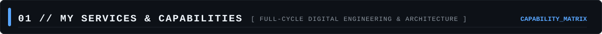
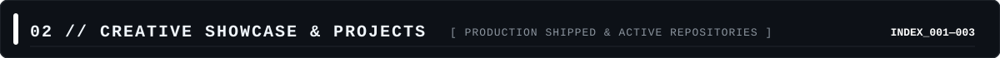
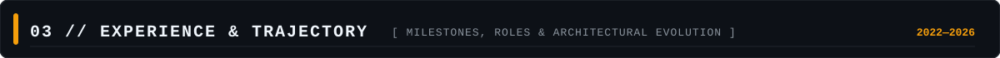
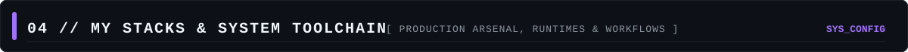
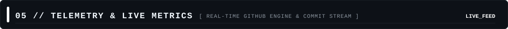

<div align="center">


<br/><br/>

<code>PROFILE://MOHAMMAD_RAFY_RAHMAWAN</code>
&nbsp;&nbsp;
<code>STATUS://ACTIVE_BUILDING</code>
&nbsp;&nbsp;
<code>LOC://YOGYAKARTA.ID</code>
&nbsp;&nbsp;
<code>KERNEL://v2.6_MONO</code>

</div>

<br/>

```text
┌────────────────────────────────────────────────────────────────────────────────────────┐
│  HELLO, WORLD. I AM RAFY (RAYNE LOPE)                                                  │
├────────────────────────────────────────────────────────────────────────────────────────┤
│  Information Systems scholar & multi-disciplinary engineer crafting high-impact digital│
│  experiences. I bridge the gap between game systems netcode (Roblox/Luau), native      │
│  mobile architecture (Flutter/Kotlin), scalable web platforms, and 3D pipelines.       │
│                                                                                        │
│  "The developers who build with intent shape the future. Let's create something real." │
└────────────────────────────────────────────────────────────────────────────────────────┘
```

<br/>

<!-- ==================== 01 // MY SERVICES ==================== -->


<table>
<tr>
<td width="50%" valign="top">

### `🕹️ 01 // GAME SYSTEMS & DEV`

Crafting tactical game mechanics, combat state machines, multiplayer synchronization, and custom UI systems.

* **Engine & Logic**: Roblox Studio, Luau, Game Loop Architecture
* **Specialties**: Top-Down Combat, Inventory State, Enemy AI & Pathfinding
* **Asset Workflow**: Hard-Surface 3D, Rigging & Animation in Blender

</td>
<td width="50%" valign="top">

### `📱 02 // MOBILE ENGINEERING`

Engineering responsive, high-performance mobile applications with custom hardware integrations.

* **Stack**: Flutter, Dart, Kotlin, Android SDK
* **Graphics**: CameraX Pipeline, Real-Time OpenGL Shaders
* **Architecture**: Clean Architecture, Reactive State Management

</td>
</tr>
<tr>
<td width="50%" valign="top">

### `🌐 03 // WEB & FULLSTACK`

Building modern, blazing-fast web platforms with strict type-safety and accessible user experiences.

* **Frameworks**: Next.js, React, TypeScript, Node.js
* **Styling**: Tailwind CSS, CSS Modules, Responsive Layouts
* **Ecosystem**: REST APIs, GIS & Spatial Maps, Vercel Edge

</td>
<td width="50%" valign="top">

### `🎨 04 // 3D PIPELINE & UI/UX`

Designing tactile product interfaces, design systems, and optimized 3D game assets.

* **3D Art**: Blender (Hard-Surface, Low-Poly & Stylized Environments)
* **UI/UX Design**: Figma, Component Systems, Interactive Prototyping
* **Direction**: Cyberpunk, Retro-Terminal & Minimalist Aesthetics

</td>
</tr>
</table>

<br/>

<!-- ==================== 02 // CREATIVE SHOWCASE ==================== -->


<table>
<tr>
<td width="33%" valign="top">

### `001 // JOMBI`

<a href="https://github.com/Rayne-lope/zombie-roblox">
  
</a>

Top-down tactical co-op zombie survival game built on Roblox. Features weapon mechanics, custom inventory, wave progression, and post-apocalyptic 3D assets.

`Luau` `Roblox` `Blender` `Combat`

</td>
<td width="33%" valign="top">

### `002 // RANA`

<a href="https://github.com/Rayne-lope/rana">
  
</a>

Pro Android camera application engineered for real-time image processing, custom GL shaders, analog-inspired tactile controls, and low-latency capture.

`Flutter` `Kotlin` `CameraX` `OpenGL`

</td>
<td width="33%" valign="top">

### `003 // KARANGTALUN`

<a href="https://github.com/Rayne-lope/Karangtalun">
  
</a>

Official village information ecosystem & web platform built for KKN Karangtalun, providing local services, GIS mapping, news feed, and cultural galleries.

`Next.js` `TypeScript` `Tailwind` `GIS`

</td>
</tr>
</table>

<div align="center">
  <br/>
  <a href="https://github.com/Rayne-lope?tab=repositories">
    
  </a>
</div>

<br/>

<!-- ==================== 03 // EXPERIENCE & TRAJECTORY ==================== -->


```text
┌────────────────────────────────────────────────────────────────────────────────────────┐
│  CAREER TRAJECTORY & ENGINEERING MILESTONES                                            │
├────────────────────────────────────────────────────────────────────────────────────────┤
│                                                                                        │
│  [2024 — PRESENT] ──● LEAD GAME DEVELOPER & SYSTEMS ARCHITECT                          │
│                     │  Project: JOMBI (Tactical Co-op Survival)                        │
│                     │  • Engineered multiplayer combat systems, ballistics & enemy AI. │
│                     │  • Architected modular inventory and networked state sync.       │
│                     │  • Authored hard-surface 3D weapons & environment assets.        │
│                     │                                                                  │
│  [2023 — 2024]    ──● MOBILE & REAL-TIME GRAPHICS DEVELOPER                            │
│                     │  Project: Rana Pro Camera Application                            │
│                     │  • Implemented CameraX frame pipelines with Kotlin & Android NDK.│
│                     │  • Integrated custom OpenGL shader color-grading in Flutter.     │
│                     │  • Built zero-latency analog camera UI/UX with haptic feedback.  │
│                     │                                                                  │
│  [2023 — 2023]    ──● FULLSTACK LEAD & WEB ARCHITECT                                   │
│                     │  Project: Karangtalun Village Digital Platform                   │
│                     │  • Designed and deployed public portal using Next.js & Tailwind. │
│                     │  • Integrated spatial GIS mapping and dynamic publication tools. │
│                     │                                                                  │
│  [2022 — PRESENT] ──● UNDERGRADUATE IN INFORMATION SYSTEMS                             │
│                        Institution: UPN "Veteran" Yogyakarta                           │
│                        • Focus: Software Architecture, Database Systems, UI/UX, Game   │
│                                                                                        │
└────────────────────────────────────────────────────────────────────────────────────────┘
```

<br/>

<!-- ==================== 04 // MY STACKS ==================== -->


<div align="center">

<br/>


<br/><br/>

<code>MOBILE</code>&nbsp;&nbsp;
<code>GAME DEV</code>&nbsp;&nbsp;
<code>WEB SYSTEMS</code>&nbsp;&nbsp;
<code>UI/UX DESIGN</code>&nbsp;&nbsp;
<code>3D PIPELINE</code>

</div>

<br/>

```text
SYSTEM_MAP
├── mobile/
│   ├── Flutter / Dart [cross-platform UI]
│   ├── Kotlin / Android SDK [hardware & CameraX]
│   └── OpenGL / Shader Pipelines [real-time rendering]
│
├── game/
│   ├── Roblox Studio / Luau [gameplay architecture]
│   ├── Multiplayer Netcode [state sync & replication]
│   └── Blender 3D [hard-surface, rigging & environment]
│
├── web/
│   ├── Next.js / React [SSR & interactive UI]
│   ├── TypeScript / Node.js [type-safe runtime]
│   └── Tailwind CSS [design token systems]
│
└── design/
    ├── Figma [interface prototyping & UX flows]
    └── Product Design [tactile & aesthetic ergonomics]
```

<br/>

<!-- ==================== 05 // TELEMETRY & STATS ==================== -->


<div align="center">

<br/>


&nbsp;&nbsp;


<br/><br/>

<a href="https://github.com/Rayne-lope">
  
</a>

</div>

<br/>

<!-- ==================== 06 // MONUMENTAL ARCHITECTURAL FOOTER (REF 2) ==================== -->

<!-- Ambient Animated Video/GIF Stage -->
<div align="center">
  
</div>

<br/>

<!-- Philosophical Statement & Deploy CTA (Directly from Reference 2) -->
<table>
<tr>
<td width="72%" valign="middle">

### `The developers that build earliest shape the standard.`<br/>`The ones that wait, maintain the legacy.`

<sub><code>PHILOSOPHY://BUILT_WITH_INTENT</code> &nbsp;•&nbsp; <code>HIGH_LEVERAGE_ENGINEERING</code></sub>

</td>
<td width="28%" align="center" valign="middle">

<a href="mailto:rapirahmawan@gmail.com?subject=Collaboration%20Inquiry%20from%20GitHub&body=Hi%20Rafy,%0A%0AI%20came%20across%20your%20GitHub%20profile%20and%20would%20love%20to%20collaborate%20with%20you!">
  
</a>

<br/><br/>

<sub><code>STATUS: OPEN_FOR_COLLAB</code></sub>

</td>
</tr>
</table>

<br/>

<!-- Ghosted Watermark & Navigation Bar -->


<div align="center">
  <br/>
  <a href="https://github.com/Rayne-lope"></a>&nbsp;
  <a href="mailto:rapirahmawan@gmail.com"></a>&nbsp;
  <a href="https://linkedin.com"></a>&nbsp;
  <a href="https://instagram.com"></a>&nbsp;
  <a href="https://x.com"></a>
  <br/><br/>
  <sub><code>© 2026 RAYNE LOPE // MOHAMMAD RAFY RAHMAWAN // ALL SYSTEMS NOMINAL</code></sub>
</div>
