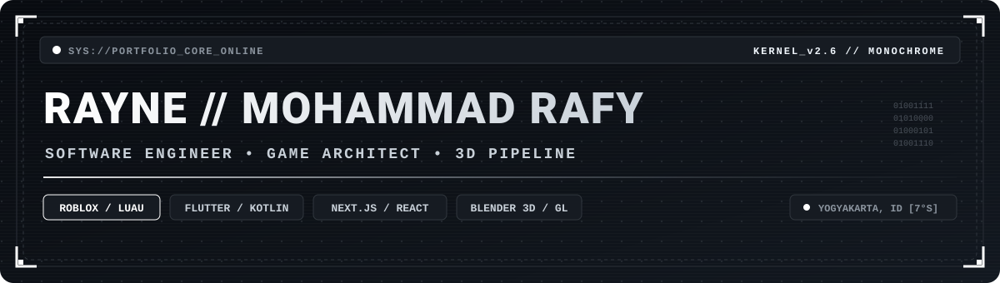
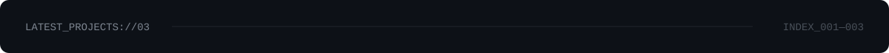
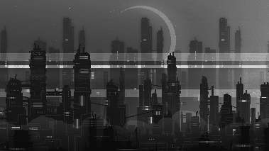
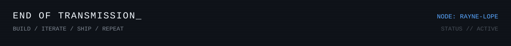

<div align="center">



<br/>

<code>PROFILE://MOHAMMAD_RAFY_RAHMAWAN</code>
&nbsp;&nbsp;
<code>STATUS://BUILDING</code>
&nbsp;&nbsp;
<code>LOC://YOGYAKARTA.ID</code>

</div>

<br/>

```text
┌──────────────────────────────────────────────────────────────────────────────┐
│  HELLO, WORLD.                                                              │
├──────────────────────────────────────────────────────────────────────────────┤
│  Information Systems student building software, games, and digital          │
│  experiences. I work across mobile development, Roblox, web systems,        │
│  UI/UX, and 3D workflows — usually turning an idea into something usable.   │
└──────────────────────────────────────────────────────────────────────────────┘
```

<table>
<tr>
<td width="33%" valign="top">

### `01 // IDENTITY`


UPN "Veteran" Yogyakarta


Software / Game / Product

</td>
<td width="33%" valign="top">

### `02 // CURRENT`


Top-down co-op zombie survival.


Premium camera application.

</td>
<td width="33%" valign="top">

### `03 // INTERESTS`


</td>
</tr>
</table>

<br/>



<table>
<tr>
<td width="33%" valign="top">

<h3 align="left"><code>001 // JOMBI</code></h3>

<a href="https://github.com/Rayne-lope/zombie-roblox">
  
</a>

Top-down co-op zombie survival game for Roblox. Tactical combat, exploration, role-based team play, custom UI/UX, and a stylized post-apocalyptic world.

`Luau` `Roblox` `Blender`

</td>
<td width="33%" valign="top">

<h3 align="left"><code>002 // RANA</code></h3>

<a href="https://github.com/Rayne-lope/rana">
  
</a>

Android camera application focused on real-time rendering, image processing, custom camera systems, and a refined analog-inspired interface.

`Flutter` `Kotlin` `CameraX` `OpenGL`

</td>
<td width="33%" valign="top">

<h3 align="left"><code>003 // KARANGTALUN</code></h3>

<a href="https://github.com/Rayne-lope/Karangtalun">
  
</a>

Village information platform developed for KKN Karangtalun, covering local information, activities, gallery content, and community potential.

`Next.js` `TypeScript` `Tailwind`

</td>
</tr>
</table>

<br/>

## `// TOOLCHAIN`

<div align="center">


<br/><br/>

<code>MOBILE</code>&nbsp;&nbsp;
<code>GAME DEV</code>&nbsp;&nbsp;
<code>WEB</code>&nbsp;&nbsp;
<code>UI/UX</code>&nbsp;&nbsp;
<code>3D PIPELINE</code>

</div>

<br/>

```text
SYSTEM_MAP
├── mobile/
│   ├── Flutter
│   ├── Dart
│   └── Kotlin
│
├── game/
│   ├── Roblox
│   ├── Luau
│   └── Blender
│
├── web/
│   ├── TypeScript
│   ├── Next.js
│   └── Tailwind CSS
│
└── design/
    ├── Figma
    └── product systems
```

<br/>

## `// ACTIVITY_LOG`

<div align="center">


<br/>


</div>

<br/>

## `// ACTIVE_OBJECTIVES`

```text
[01] JOMBI
     └─ gameplay systems / maps / combat / UI / asset pipeline

[02] RANA
     └─ camera rendering / image processing / Android integration

[03] 3D + GAME PIPELINE
     └─ Blender workflows / Roblox assets / environment design
```

<br/>

<div align="center">





<sub><code>© 2026 // RAYNE-LOPE // ALL SYSTEMS NOMINAL</code></sub>

</div>
